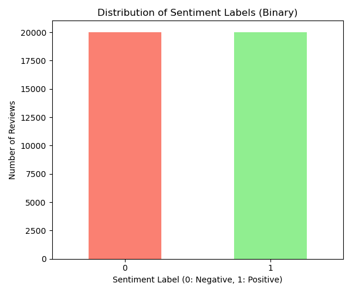

# AI/ML Sentiment Analysis Portfolio Projects

This repository showcases two end-to-end machine learning projects focused on sentiment analysis, built with Python and Flask. They demonstrate various aspects of the ML pipeline, web application integration, and tackling real-world data challenges like class imbalance.

# Multi-Class Movie Overview Sentiment Analyzer

An end-to-end machine learning application that classifies movie overviews from the IMDb Top 1000 dataset into multiple sentiment categories (Excellent, Great, Very Good, Good, One Time Watch!, Needs Improvement) based on their IMDb ratings. This project highlights working with challenging, imbalanced data and exploring different modeling techniques.

### Demo

Interact with the multi-class sentiment analysis web application locally by following the setup steps below and navigating to `http://127.0.0.1:5000/`.

### Features

* Loads movie data from a CSV ([`imdb_top_1000.csv`](imdb_top_1000.csv)).
* Creates multi-class sentiment labels based on IMDb rating ranges.
* Performs text preprocessing (cleaning, tokenization, stop word removal).
* Uses TF-IDF for text vectorization.
* Trains a Support Vector Classifier (SVC) with balanced class weights to handle data imbalance.
* Evaluates the model's performance using metrics appropriate for multi-class and imbalanced data.
* Saves the trained model and TF-IDF vectorizer using `joblib`.
* Provides a simple Flask web interface to analyze new movie overviews and predict their sentiment category.

### Project Structure

ulti_class_sentiment_app/
├── senti.py              # Data processing, model training, evaluation, and saving script
├── app.py                # Flask web application script
├── templates/
│   └── index.html        # HTML and JavaScript for the web interface
├── imdb_top_1000.csv     # The dataset used
└── # Saved models (generated after running senti.py)
# ├── svc_model.joblib
# └── tfidf_vectorizer.joblib

*(Note: The .joblib files are generated when you run `senti.py`.)*

### Data Source

* **IMDb Top 1000 Dataset:** Describe the source of this dataset. Explain how you derived the multi-class sentiment labels from the `IMDB_Rating` column using specific rating ranges (e.g., 9.0+ for Excellent, 8.5-8.9 for Great, etc.). **Discuss the class imbalance** you encountered and show the value counts for your sentiment categories.

#### Data Distribution

*(After running `senti.py`, get the image path relative to this README, e.g., `multi_class_sentiment_distribution.png`)*

### Machine Learning Approach

* **Problem Type:** Multi-class text classification.
* **Text Preprocessing:** Applied cleaning (removing HTML, non-alphabetic chars, lowercasing), tokenization, and stop word removal.
* **Text Representation:** TF-IDF vectorization was used to convert text into numerical features.
* **Model:** Support Vector Classifier (SVC) with a linear kernel was chosen for its effectiveness in high-dimensional spaces.
* **Imbalance Handling:** `class_weight='balanced'` was used during SVC training to give more importance to the minority classes. (You can also briefly mention other techniques you tried like Logistic Regression, Multinomial Naive Bayes, SMOTE and how SVC compared).
* **Evaluation:** Explain the metrics used (Accuracy, Weighted Precision, Recall, F1-Score) and why weighted metrics are important for imbalanced data.

### Results and Evaluation

*(After running `senti.py`, fill in the metrics you got)*

The model was evaluated on a held-out test set. The results are as follows:

#### Evaluation Metrics

Model Evaluation Metrics (Multi-class):
Accuracy: 0.4950
Precision (weighted): 0.5085
Recall (weighted): 0.4950
F1-Score (weighted): 0.4813

#### Confusion Matrix

#### Classification Report

          precision    recall  f1-score   support
Excellent   0.00      0.00      0.00         1
Good        0.54      0.63      0.58       107
Great       1.00      0.10      0.18        10
Very Good   0.41      0.38      0.39        82

accuracy                        0.49       200
macro avg   0.49      0.28      0.29       200
weighted avg  51      0.49      0.48       200

*(Update the category names in the report above to match your specific output order if needed)*

### Lessons Learned / Challenges

* Working with highly imbalanced real-world data is challenging, significantly impacting model performance, especially for minority classes.
* Understanding and using evaluation metrics beyond simple accuracy (like weighted precision, recall, and F1-score, and the confusion matrix) is essential for imbalanced classification.
* Different models and techniques (class weights, potentially resampling) can have varying effectiveness on imbalanced text data with different feature representations.

### Future Improvements

* Explore more advanced techniques for handling severe imbalance (e.g., more sophisticated resampling, synthetic data generation).
* Experiment with different models better suited for imbalanced data or explore ensemble methods.
* Investigate more advanced text representations like Sentence Embeddings in combination with different models (e.g., simple neural networks) for this multi-class task.
* Perform hyperparameter tuning to optimize the SVC and TF-IDF vectorizer.

### Getting Started

To run this project locally:

1.  Clone the main repository: `git clone https://github.com/[Your GitHub Username]/AI-ML-apps.git`
2.  Navigate to this project folder: `cd AI-ML-apps/multi_class_sentiment_app`
3.  Ensure you have a Python virtual environment activated (e.g., with Conda) and the necessary libraries installed (pandas, scikit-learn, nltk, flask, joblib, matplotlib).
4.  Download the required NLTK data (commands provided in `senti.py`).
5.  Place the `imdb_top_1000.csv` file in this folder.
6.  Train the model: `python senti.py`
7.  Run the Flask application: `python app.py`
8.  Access the web app in your browser at `http://127.0.0.1:5000/`.

# Binary Movie Review Sentiment Analyzer

An end-to-end machine learning application that classifies movie reviews into binary (Positive/Negative) sentiment. This project demonstrates building a functional sentiment classifier on a standard dataset format.

### Demo

Interact with the binary sentiment analysis web application locally by following the setup steps below and navigating to `http://127.0.0.1:5001/`.

### Features

* Loads movie reviews and binary labels from a standard CSV ([`movie.csv`](movie.csv)).
* Performs text preprocessing (cleaning, tokenization, stop word removal).
* Uses TF-IDF for text vectorization.
* Trains a Logistic Regression model for binary classification, utilizing class weights (optional, depending on data balance).
* Evaluates the model using standard binary classification metrics, including ROC AUC.
* Saves the trained model and TF-IDF vectorizer using `joblib`.
* Provides a simple Flask web interface to analyze new reviews and predict Positive or Negative sentiment.

### Project Structure

binary_sentiment_app/
├── senti2.py           # Data processing, model training, evaluation, and saving script
├── app2.py             # Flask web application script
├── templates2/         # Folder for binary HTML
│   └── index2.html     # HTML and JavaScript for the web interface
├── movie.csv           # Your new binary sentiment dataset
└── # Saved models (generated after running senti2.py)
# ├── binary_sentiment_lr_v2.joblib
# └── tfidf_vectorizer_v2.joblib

*(Note: The .joblib files are generated when you run `senti2.py`.)*

### Data Source

* **Binary Sentiment Dataset:** Describe the source of this dataset (if it's a public one, provide a link). It contains a `text` column for the review content and a `label` column for binary sentiment (0 for Negative, 1 for Positive).

#### Data Distribution

*(After running `senti2.py`, get the image path relative to this README, e.g., `binary_sentiment_distribution.png`)*

### Machine Learning Approach

* **Problem Type:** Binary text classification.
* **Text Preprocessing:** Applied cleaning, tokenization, and stop word removal.
* **Text Representation:** TF-IDF vectorization.
* **Model:** Logistic Regression was used as a strong baseline classifier for binary text classification.
* **Imbalance Handling:** `class_weight='balanced'` was used during training to help handle potential imbalance (even if less severe than in the multi-Class project).
* **Evaluation:** Evaluated using Accuracy, Precision, Recall, F1-Score, and ROC AUC.

### Results and Evaluation

The model was evaluated on a held-out test set. The results are as follows:

#### Evaluation Metrics

Model Evaluation Metrics (Binary Classification):
Accuracy: 0.8866
Precision (Positive class): 0.8826
Recall (Positive class): 0.8916
F1-Score (Positive class): 0.8871
ROC AUC: 0.9557

#### Confusion Matrix

"C:\Users\siddi\AI_ML_Portfolio\binary_sentiment_app\binary_confusion_matrix.png"

#### Classification Report

          precision    recall  f1-score   support

Negative       0.89      0.88      0.89       4004
Positive       0.88      0.89      0.89       3996

accuracy                           0.89       8000
macro avg      0.89      0.89      0.89       8000
weighted avg   0.89      0.89      0.89       8000

*(Note: The classification report shows performance metrics for each individual class.)*

### Future Improvements

* Perform hyperparameter tuning for the Logistic Regression model and TF-IDF vectorizer.
* Experiment with other binary classifiers (e.g., SVC, Naive Bayes) and compare performance.
* Explore using Sentence Embeddings or other advanced text representations for binary classification.
* Implement more detailed web app features (e.g., prediction probabilities).

### Getting Started

To run this project locally:

1.  Clone the main repository: `git clone https://github.com/fxs2596/AI-ML-apps.git`
2.  Navigate to this project folder: `cd AI-ML-apps/binary_sentiment_app`
3.  Ensure you have a Python virtual environment activated (e.g., with Conda) and the necessary libraries installed (pandas, scikit-learn, nltk, flask, joblib, matplotlib).
4.  Download the required NLTK data (commands provided in `senti2.py`).
5.  Place the `movie.csv` file in this folder.
6.  Train the model: `python senti2.py`
7.  Run the Flask application: `python app2.py`
8.  Access the web app in your browser at `http://127.0.0.1:5001/`.

